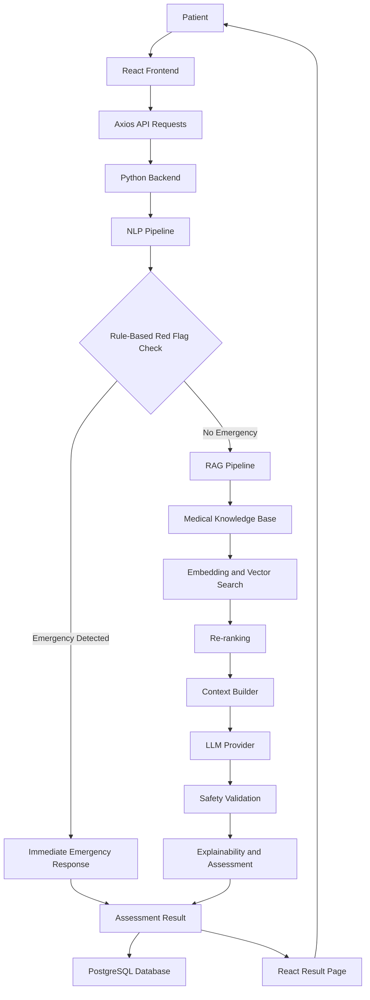
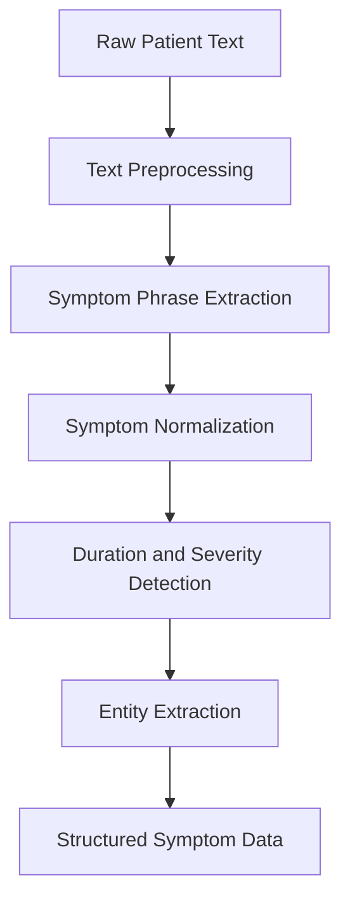
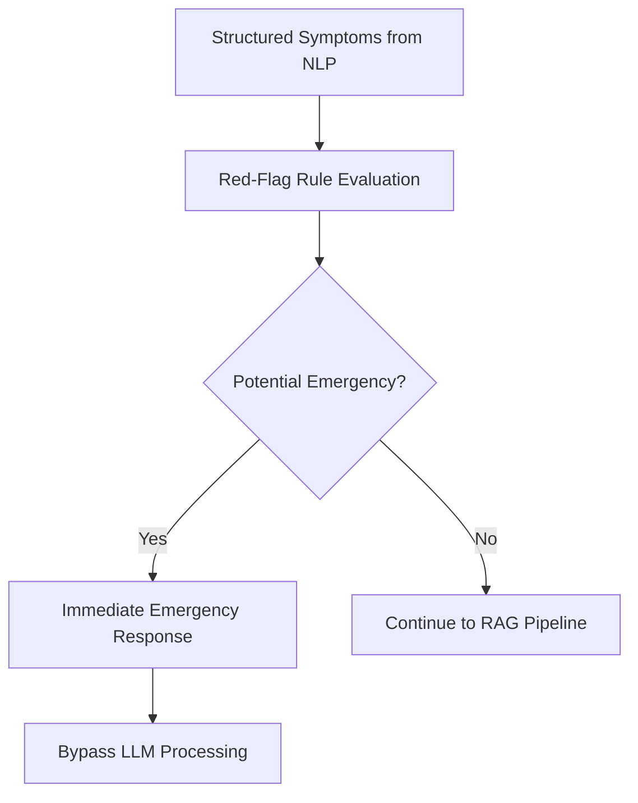
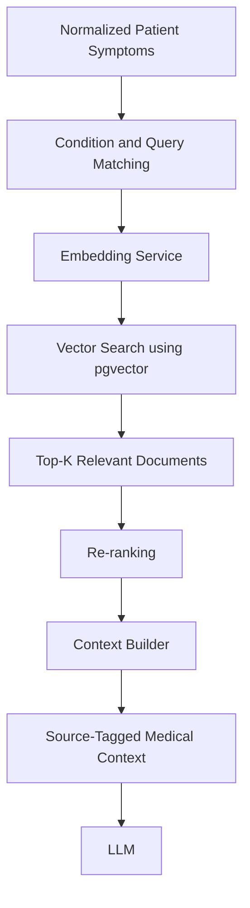
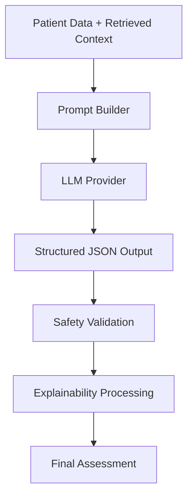

# 🏥 Reliable Medical Support System
### AI-Assisted Preliminary Medical Assessment Using NLP, RAG, and Large Language Models

<p align="center">
  <b>A Full-Stack AI-Assisted Healthcare Support Application</b>
  <br>
  Dhaka University of Engineering & Technology (DUET), Gazipur
  <br>
  Department of Computer Science and Engineering
</p>

<p align="center">
  
  
  
  
  
</p>

---

## 📌 Table of Contents

- [Overview](#-overview)
- [Project Objectives](#-project-objectives)
- [Key Features](#-key-features)
- [System Architecture](#-system-architecture)
- [How the System Works](#-how-the-system-works)
  - [1. Patient Input](#1-patient-input)
  - [2. NLP Pipeline](#2-natural-language-processing-nlp-pipeline)
  - [3. Rule-Based Emergency Detection](#3-rule-based-emergency-detection)
  - [4. Retrieval-Augmented Generation (RAG)](#4-retrieval-augmented-generation-rag-pipeline)
  - [5. LLM-Based Assessment](#5-large-language-model-llm-pipeline)
  - [6. Safety Validation and Explainability](#6-safety-validation-and-explainability)
  - [7. Assessment Storage](#7-assessment-storage)
- [Technology Stack](#-technology-stack)
- [Database Design](#-database-design)
- [Application Modules](#-application-modules)
- [Testing](#-testing)
- [Project Limitations](#-project-limitations)
- [Future Improvements](#-future-improvements)
- [Team Members](#-team-members)
- [Academic Information](#-academic-information)
- [Disclaimer](#-medical-disclaimer)

---

## 🔍 Overview

The **Reliable Medical Support System** is an AI-assisted preliminary medical support application designed to help patients understand their reported symptoms and receive structured, non-diagnostic health assessments.

The system allows patients to describe their symptoms in natural language and provides a structured assessment by combining Natural Language Processing (NLP), a medical knowledge base, Retrieval-Augmented Generation (RAG), a Large Language Model (LLM), and an independent rule-based safety layer.

Unlike a simple medical chatbot that generates responses directly from an LLM, this application follows a multi-stage processing pipeline. Patient-provided information is first processed through NLP, emergency symptoms are checked independently, and relevant medical information is retrieved from a knowledge base before the LLM generates a preliminary assessment.

The generated assessment is then subjected to safety validation and explainability processing before being presented to the patient.

The application also provides user authentication, patient-specific assessment history, and medical record management through a full-stack web architecture.

### Core Concept

**Natural Language Processing + Rule-Based Safety + Retrieval-Augmented Generation + Large Language Model + Full-Stack Web Application**

The primary goal is to provide an accessible, structured, and evidence-informed preliminary medical support experience while maintaining clear limitations around AI-generated medical information.

---

## 🎯 Project Objectives

The main objectives of the project are:

1. **Natural Language Symptom Processing:** Allow patients to describe their symptoms in plain language rather than requiring predefined medical terminology.

2. **Independent Emergency Detection:** Identify potential emergency or red-flag symptoms before making any AI API call.

3. **Knowledge-Grounded Responses:** Use Retrieval-Augmented Generation to ground AI-generated assessments in relevant medical knowledge base content.

4. **Explainable Assessments:** Explain why a condition or urgency level was suggested by identifying relevant symptoms, factors, and retrieved medical sources.

5. **Patient Data Privacy:** Maintain authenticated access and ensure that each assessment is associated with the patient who created it.

6. **Structured Medical Support:** Generate organized preliminary assessments containing possible conditions, urgency information, warning signs, and recommendations.

---

## ✨ Key Features

### 1. User Authentication and Account Management
- User registration and login.
- Email-based account identification.
- Password hashing using Argon2.
- JWT-based authentication for protected application access.

### 2. AI-Assisted Symptom Assessment
- Accepts free-text symptom descriptions.
- Extracts and normalizes symptom information.
- Processes symptom duration and severity.
- Generates structured preliminary health assessments.

### 3. Rule-Based Emergency Detection
- Checks for emergency-related red-flag symptoms independently of the LLM.
- Performs emergency screening before AI processing.
- Provides an immediate emergency response when red-flag conditions are detected.

### 4. Medical Knowledge Retrieval
- Retrieves relevant medical information from the knowledge base.
- Uses semantic embeddings and vector similarity search.
- Supports symptom-aware relevance matching and result re-ranking.
- Associates retrieved information with source references.

### 5. AI-Generated Medical Support
- Uses retrieved medical context to guide LLM responses.
- Produces structured assessment output.
- Presents possible conditions and relevant recommendations.
- Provides explanations based on reported symptoms and retrieved context.

### 6. Patient Dashboard and Assessment History
- Patient dashboard with assessment overview.
- Access to previous assessment records.
- Patient-specific medical assessment history.
- Summary of recent assessment activities.

### 7. Explainability and Source Attribution
- Displays relevant symptoms and assessment factors.
- Provides explanations for suggested conditions or urgency levels.
- Displays retrieved medical knowledge sources used in the assessment.

---

## 🏗️ System Architecture

The application follows a layered full-stack architecture that separates user interaction, backend processing, emergency safety, medical knowledge retrieval, AI generation, and persistent data storage.

### High-Level Architecture



### Architectural Components

| Component | Responsibility |
|---|---|
| React Frontend | Patient interaction, forms, dashboard, and assessment display |
| Python Backend | Application logic, processing orchestration, and API handling |
| NLP Pipeline | Symptom extraction, normalization, and entity processing |
| Rule-Based Safety Layer | Independent emergency screening before LLM processing |
| RAG Pipeline | Retrieval of relevant medical information from the knowledge base |
| LLM | Structured, context-grounded preliminary assessment generation |
| PostgreSQL | Persistent storage for application and medical assessment data |
| pgvector | Vector storage and semantic similarity search |
| JWT and Argon2 | Authentication and password security |

---

## ⚙️ How the System Works

The complete assessment process consists of several interconnected stages.

### 1. Patient Input

Patients interact with the system through the React-based web interface.

A patient can enter information such as:

- Symptom descriptions
- Age
- Gender
- Symptom duration
- Symptom severity

For example:

> "I have been experiencing fever, sore throat, and body aches for the last three days."

The frontend collects the information through a structured form and sends it to the Python backend using HTTP requests.

**Technologies:** React, TypeScript, React Hook Form, Axios.

---

### 2. Natural Language Processing (NLP) Pipeline

The NLP pipeline converts free-text patient descriptions into structured symptom information.

The system uses spaCy and custom rule-based NLP techniques to process the reported symptoms.

#### NLP Workflow



#### Step 1: Text Preprocessing

The raw patient input is processed to prepare it for symptom extraction and matching.

#### Step 2: Symptom Extraction

Relevant symptom phrases are identified from the patient's description.

Example:

```text
Input:
"I have fever, sore throat, and body aches."

Extracted symptoms:
- Fever
- Sore throat
- Body aches
```

#### Step 3: Symptom Normalization

Different expressions referring to similar symptoms are mapped to canonical symptom names.

For example, alternative expressions related to elevated body temperature can be normalized to a standard symptom representation.

This helps maintain consistency during knowledge base retrieval.

#### Step 4: Duration and Severity Detection

The system identifies temporal and intensity-related information from the patient's description.

Example:

```text
Duration: 3 days
Severity: Moderate
```

#### Step 5: Entity Extraction

Relevant patient information and medical entities, including age, gender, and body-related terms, are extracted where available.

The output of the NLP pipeline is a structured representation of the patient's reported symptoms, which is subsequently used for emergency screening and medical knowledge retrieval.

---

### 3. Rule-Based Emergency Detection

The system uses an independent rule-based safety layer to identify potential emergency symptoms before calling the LLM.

This is an important architectural feature because emergency screening does not depend exclusively on probabilistic AI-generated responses.

#### Emergency Processing Flow



When an emergency-related red flag is detected, the system bypasses the normal LLM-based assessment process and provides an immediate emergency response.

When no emergency is detected, the patient information continues through the RAG pipeline.

**Key design principle:** Emergency-related safety checks are handled independently of the LLM, reducing reliance on generated responses for critical safety decisions.

---

### 4. Retrieval-Augmented Generation (RAG) Pipeline

Retrieval-Augmented Generation is used to provide relevant medical knowledge to the LLM before it generates an assessment.

Instead of relying exclusively on the LLM's internal knowledge, the system retrieves relevant information from its medical knowledge base and incorporates it into the generation context.

#### RAG Workflow



#### Step 1: Condition and Query Matching

The normalized symptoms and related patient information are used to construct a relevant medical knowledge retrieval query.

#### Step 2: Embedding Generation

The query is converted into a numerical vector representation using an embedding service.

Embeddings represent semantic information in a numerical format, allowing the system to compare the meaning of a patient query with medical knowledge stored in the database.

#### Step 3: Vector Similarity Search

The generated query embedding is compared with medical knowledge embeddings stored in PostgreSQL using the pgvector extension.

The system uses cosine similarity and top-K retrieval to identify relevant knowledge base entries.

Conceptually:

```text
Patient Query
      |
      v
Query Embedding
      |
      v
PostgreSQL + pgvector
      |
      v
Cosine Similarity Search
      |
      v
Top-K Relevant Documents
```

#### Step 4: Re-ranking

Retrieved documents are re-ranked using semantic relevance and symptom matching information to improve the relevance of the medical context.

#### Step 5: Context Building

The selected medical information is organized into a clean, source-tagged context block.

This context is then provided to the LLM as supporting information for the assessment.

**Purpose of RAG:** Improve the relevance and traceability of generated medical information by grounding responses in retrieved knowledge base content.

---

### 5. Large Language Model (LLM) Pipeline

After relevant medical context is retrieved, the system sends the patient information and supporting context to an LLM provider.

The LLM generates a structured preliminary assessment based on the provided information.

#### LLM Workflow



#### Step 1: Prompt Building

The prompt is constructed using the following components:

- System instructions
- Patient-provided information
- Retrieved medical knowledge context
- Assessment generation task

This provides the LLM with relevant information and instructions for generating a structured response.

#### Step 2: LLM-Based Generation

The LLM interprets the patient information alongside the retrieved medical context to generate a preliminary assessment.

The generated content may include:

- Symptom summary
- Possible conditions
- Urgency information
- Warning signs
- Recommendations
- Assessment explanations

The system is designed for preliminary medical support, not confirmed medical diagnosis.

#### Step 3: Structured Output

The LLM is instructed to follow a strict JSON output schema.

This allows the backend to process the generated assessment in a structured format and return organized information to the frontend.

---

### 6. Safety Validation and Explainability

The generated LLM response is subjected to a validation and explanation stage before being presented to the patient.

#### Safety Validation

The validation stage checks the generated response against the expected output structure and relevant source and safety constraints.

The purpose is to identify unsupported information, validate source references, and ensure that the generated response follows the system's assessment requirements.

Emergency safety remains independently enforced through the rule-based red-flag layer.

#### Explainability

The system provides explanations for suggested conditions and urgency levels by presenting relevant assessment factors.

The explanation may include:

- Reported symptoms that contributed to the assessment
- Relevant symptom duration and severity
- Retrieved medical knowledge
- Source references associated with the assessment

This helps users understand the basis of the preliminary assessment rather than receiving only a condition name or generated recommendation.

---

### 7. Assessment Storage

After the assessment is processed, the relevant patient-specific information and assessment history are stored in PostgreSQL.

The frontend receives the assessment result and displays it through the result page.

The application also supports access to previous assessments through the dashboard and history interface.

The system associates patient records with authenticated users to support patient-specific access and ownership.

---

## 🛠️ Technology Stack

The project combines modern frontend technologies, a Python backend, relational database storage, NLP, semantic retrieval, and LLM-based generation.

### Frontend

| Technology | Purpose |
|---|---|
| React 18 | Component-based user interface |
| TypeScript | Static typing and improved maintainability |
| Vite | Frontend development server and build tooling |
| Tailwind CSS | Responsive styling and UI design |
| React Router | Client-side routing and navigation |
| React Hook Form | Form state management and input handling |
| Axios | HTTP communication between frontend and backend |

### Backend and AI

| Technology | Purpose |
|---|---|
| Python 3.11 | Backend application logic |
| SQLAlchemy 2.0 | Python ORM and database interaction |
| spaCy | Natural Language Processing |
| Custom Rule-Based NLP | Symptom phrase matching, normalization, and structured extraction |
| RAG | Medical knowledge retrieval and context-grounded generation |
| LLM Provider API | Structured natural-language assessment generation |

### Database and Security

| Technology | Purpose |
|---|---|
| PostgreSQL 16 | Relational database for application and assessment data |
| pgvector | Vector storage and similarity search |
| JWT | Authentication and protected API access |
| Argon2 | Password hashing |

### Testing and Deployment

| Technology | Purpose |
|---|---|
| Docker | Containerization and environment consistency |
| pytest | Backend testing |
| Vitest | Frontend testing |
| React Testing Library | Frontend component and interaction testing |

---

## 🗄️ Database Design

The application uses PostgreSQL to maintain user information, medical knowledge, assessment history, and related application data.

The UML design includes the following major entities:

| Entity | Description |
|---|---|
| `users` | User accounts, identity, password hash, and role information |
| `administrators` | Administrator identity and permission information |
| `knowledgeBase` | Medical knowledge articles and their content |
| `chatHistory` | Patient interactions, messages, responses, and timestamps |
| `medicalRecords` | Patient-specific medical assessment records |
| `notifications` | User-associated notification information |

### Database Design Overview

```mermaid
erDiagram
    USERS ||--o{ CHATHISTORY : creates
    USERS ||--o{ MEDICALRECORDS : owns
    USERS ||--o{ NOTIFICATIONS : receives
    CHATHISTORY ||--o{ MEDICALRECORDS : associated_with
    USERS ||--o| ADMINISTRATORS : may_have

    USERS {
        int userId
        string name
        string email
        string passwordHash
        string role
    }

    CHATHISTORY {
        int chatId
        int userId
        string message
        string response
        timestamp timestamp
    }

    MEDICALRECORDS {
        int recordId
        int chatId
        int userId
        string symptoms
        string recommendation
    }

    NOTIFICATIONS {
        int notifId
        int userId
        string type
        string status
    }

    ADMINISTRATORS {
        int adminId
        int userId
        string permissions
    }
```



*Note: This diagram represents the logical relationships described in the project presentation. The actual database constraints and field types are defined by the implementation.*

### Patient Data Ownership

The application uses JWT-based authentication to identify authenticated users and associates medical assessment records with user IDs.

This design supports patient-specific record retrieval and helps prevent unauthorized access to another patient's assessment history.

Passwords are protected using Argon2 hashing rather than being stored as plain-text passwords.

---

## 🖥️ Application Modules

The application provides a web-based interface for patient interaction and assessment management.

### 1. Registration and Login

Allows new users to create accounts and existing users to authenticate using their registered credentials.

### 2. Dashboard

Provides an overview of the patient's assessment activities and navigation to the main application features.

### 3. Symptom Assessment Form

Allows patients to submit symptom descriptions and relevant information for preliminary assessment.

### 4. Assessment Result Page

Displays structured assessment information, possible conditions, urgency details, recommendations, warning signs, explanations, and retrieved medical knowledge sources.

### 5. Assessment History

Provides access to previous patient-specific assessments.

### 6. Profile and Account Management

Provides user account-related functionality through the application interface.

---

## 🧪 Testing

The project uses separate testing tools for the backend and frontend.

| Testing Layer | Framework | Purpose |
|---|---|---|
| Backend | pytest | Testing Python application logic and backend components |
| Frontend | Vitest | Testing frontend functionality |
| UI Components | React Testing Library | Testing React component behavior and interactions |

The testing setup is intended to support application reliability, component correctness, and maintainability.

---

## ⚠️ Project Limitations

The current implementation has several important limitations.

### 1. Limited Medical Knowledge Base

The system currently uses a small demonstration medical knowledge dataset that has not been clinically validated.

Consequently, the retrieved information and generated assessments should not be treated as clinically validated medical advice.

### 2. External LLM API Dependency

The full AI functionality currently depends on an external LLM provider and a valid paid API key.

Availability and operation of the AI assessment features may therefore depend on the configured provider and API access.

### 3. Preliminary, Non-Diagnostic Assessment

The application is designed to provide preliminary health support rather than a definitive diagnosis.

Its outputs depend on the accuracy of patient-provided information, the available knowledge base, the retrieval pipeline, and the LLM response.

---

## 🚀 Future Improvements

Potential future development directions include:

- Expanding the medical knowledge base using validated clinical sources.
- Improving the coverage and quality of symptom normalization and medical information retrieval.
- Supporting offline and self-hosted AI models to reduce external API dependency.
- Improving the reliability and explainability of AI-generated assessments.
- Further strengthening patient data protection and system testing.
- Expanding the application's functionality using clinically reviewed medical knowledge.

---

## 👥 Team Members

Developed by undergraduate students of the Department of Computer Science and Engineering, DUET, Gazipur.

| Name | Student ID |
|---|---|
| Abdul Owadud Raton | 214033 |
| Md. Imon Hossain | 214039 |
| Md. Mesbaul Alam | 214040 |

---

## 🎓 Academic Information

**Institution:** Dhaka University of Engineering & Technology (DUET), Gazipur

**Department:** Computer Science and Engineering

**Course:** Software Engineering Sessional

**Project Title:** Reliable Medical Support System

**Course Teachers:**

- Dr. Momotaz Begum — Professor, Department of CSE, DUET
- Mr. Liton Islam — Assistant Professor, Department of CSE, DUET

---

## ⚕️ Medical Disclaimer

**This application is an academic software engineering project intended for preliminary medical support and educational purposes only.**

It is not a substitute for professional medical advice, clinical diagnosis, or treatment.

The system has not been clinically validated, and its AI-generated assessments may be incomplete or inaccurate. Possible conditions and recommendations must not be interpreted as confirmed diagnoses.

In the event of a medical emergency or potentially life-threatening symptoms, seek immediate professional medical assistance or contact local emergency services. Do not delay emergency care while using this application.

---

<p align="center">
  <b>Reliable Medical Support System</b>
  <br>
  <i>Combining NLP, medical knowledge retrieval, and AI-assisted assessment in a safety-aware full-stack application.</i>
  <br><br>
  Developed as part of the Software Engineering Sessional at DUET, Gazipur.
</p>
